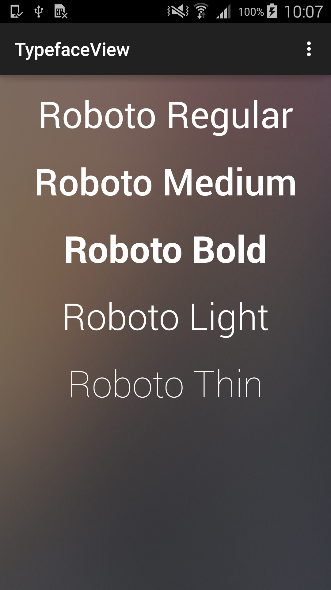

TypefaceView
================

TextView and EditText views for android which allow the user to set special typefaces; such as the Roboto typefaces (API 10+). 

Pull requests are welcome if you would like to add other typefaces to this library.

To include in your project, add this to your build.gradle file:

```
   //TypefaceView
   compile 'com.github.omadahealth.typefaceview:typefaceview:1.0.0@aar'
```


========
### By
Developers:
        [Olivier Goutay](https://github.com/olivierg13) and [Stoyan Dimitrov](https://github.com/StoyanD)

### Usage

Look at the example app for a live example on how to use the library.

#### In XML:

```
    <com.github.omadahealth.typefaceview.TypefaceTextView
        android:id="@+id/typefaceThin"
        android:layout_width="wrap_content"
        android:layout_height="wrap_content"
        android:gravity="center"
        android:layout_margin="20dp"
        android:layout_gravity="center"
        android:textColor="@android:color/white"
        android:textSize="@dimen/text_size"
        android:text="Roboto Thin"
        app:typeface="roboto_thin" />
```

#### Available typefaces in attr.xml that you can set in your app:typeface="..."

```
        <attr name="typeface" format="enum">
            <enum name="roboto_regular" value="0"/>
            <enum name="roboto_medium" value="1"/>
            <enum name="roboto_light" value="2"/>
            <enum name="roboto_bold" value="3"/>
            <enum name="roboto_thin" value="4"/>
        </attr>
```
========

### License

```
The MIT License (MIT)

Copyright (c) 2015 OrangeGangsters

Permission is hereby granted, free of charge, to any person obtaining a copy
of this software and associated documentation files (the "Software"), to deal
in the Software without restriction, including without limitation the rights
to use, copy, modify, merge, publish, distribute, sublicense, and/or sell
copies of the Software, and to permit persons to whom the Software is
furnished to do so, subject to the following conditions:

The above copyright notice and this permission notice shall be included in all
copies or substantial portions of the Software.

THE SOFTWARE IS PROVIDED "AS IS", WITHOUT WARRANTY OF ANY KIND, EXPRESS OR
IMPLIED, INCLUDING BUT NOT LIMITED TO THE WARRANTIES OF MERCHANTABILITY,
FITNESS FOR A PARTICULAR PURPOSE AND NONINFRINGEMENT. IN NO EVENT SHALL THE
AUTHORS OR COPYRIGHT HOLDERS BE LIABLE FOR ANY CLAIM, DAMAGES OR OTHER
LIABILITY, WHETHER IN AN ACTION OF CONTRACT, TORT OR OTHERWISE, ARISING FROM,
OUT OF OR IN CONNECTION WITH THE SOFTWARE OR THE USE OR OTHER DEALINGS IN THE
SOFTWARE.
```

